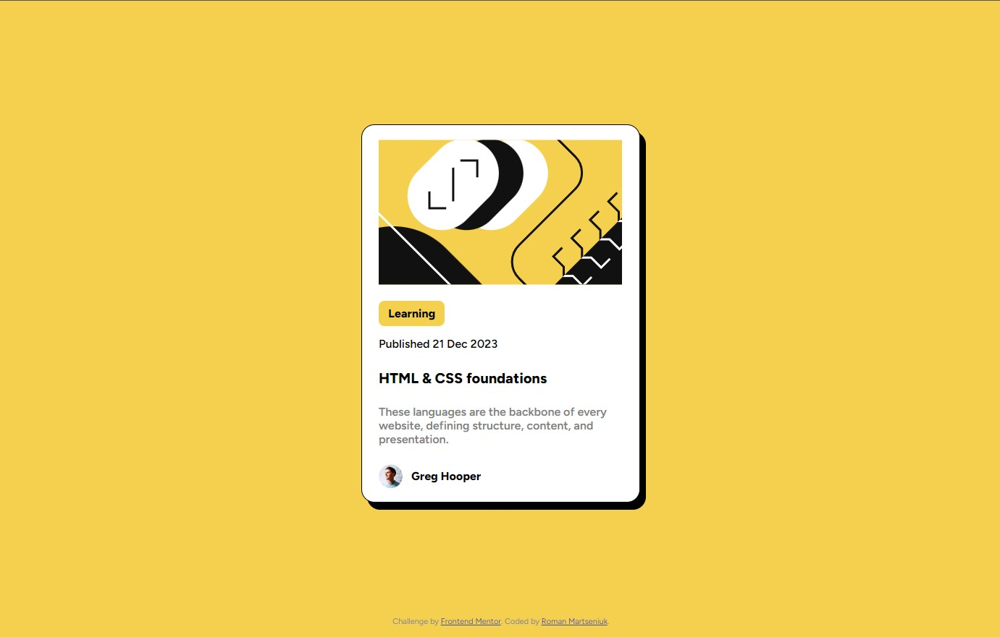

# Frontend Mentor - Blog preview card solution

This is a solution to the [Blog preview card challenge on Frontend Mentor](https://www.frontendmentor.io/challenges/blog-preview-card-ckPaj01IcS). Frontend Mentor challenges help you improve your coding skills by building realistic projects. 

## Table of contents

- [Overview](#overview)
  - [The challenge](#the-challenge)
  - [Screenshot](#screenshot)
  - [Links](#links)
- [My process](#my-process)
  - [Built with](#built-with)
  - [Useful resources](#useful-resources)
- [Author](#author)

**Note: Delete this note and update the table of contents based on what sections you keep.**

## Overview

### The challenge

Users should be able to:

- See hover and focus states for all interactive elements on the page

### Screenshot

### Links

- Solution URL: [Click here to see the solution](https://github.com/RomanMartseniuk/blog-preview-card-main)
- Live Site URL: [Click here to see the result](https://romanmartseniuk.github.io/blog-preview-card-main/)

## My process

### Built with

- Semantic HTML5 markup
- CSS custom properties
- Flexbox
- SCSS
- Mobile-first workflow

### Useful resources

- [Introduction to variable fonts on the web](https://developers.google.com/web/fundamentals/design-and-ux/typography/variable-fonts)
- [Thirty to three billion users in three years](https://variablefonts.typenetwork.com)
- [VariableFonts.io - A place to discuss and learn about variable fonts creation and use for desktop and the web](https://medium.com/variable-fonts)

## Author

- Website - [Roman Martseniuk](https://github.com/RomanMartseniuk)
- Frontend Mentor - [@RomanMartseniuk](https://www.frontendmentor.io/profile/RomanMartseniuk)
